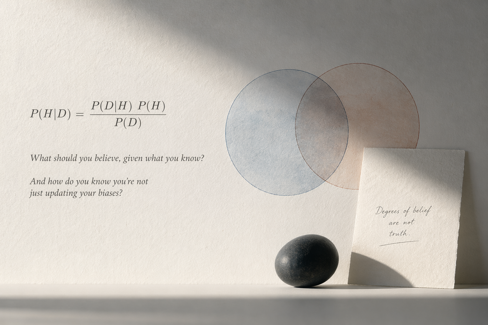

Humans are notoriously terrible at intuitive probability.

Imagine you wake up feeling slightly off. You visit the doctor, and she runs a battery of tests. A week later, she calls with bad news: you tested positive for a rare disease that affects 0.1% of the population.

Panicked, you ask how accurate the test is. "It correctly identifies 99% of people who have the disease," she says, "and only gives a false positive to 1% of healthy people."

If you rely on your gut, you probably assume you have a 99% chance of being sick. But here's where the math kicks in.

Most people latch onto one thing the doctor said — _"99% accurate"_ — and conclude that a positive result means a 99% chance of illness. The human brain is terrible at remembering **the prior** when presented with shiny new evidence. We fixate on the test's accuracy and forget the other crucial piece of information:

> _"...a rare disease that affects 0.1% of the population."_

So which is it — 0.1% or 99%? Neither. The true probability depends on **both** — the accuracy of the test _and_ the baseline rarity of the disease. The complete question is:

> _"Given that 0.1% of the population has this disease AND that you tested positive on a test that is 99% accurate, what are the actual chances you are sick?"_

To answer this properly, we need Bayes' theorem.

---

### The Pure Logic

Formulated in the 18th century by Thomas Bayes, the theorem calculates the probability of a hypothesis being true given new evidence:

$$
P(A∣B)=\frac{P(B \mid A) \times P(A)}{P(B)}​
$$

In plain English: the probability of your hypothesis (A) being true given new evidence (B) depends heavily on **P(A)** — the _prior probability_, the baseline reality _before_ the new evidence arrived.

In our medical example, the prior is the rarity of the disease: 0.1%. Because the disease is so rare, __the sheer volume of false positives generated from the healthy population completely drowns out the true positives__. Bayes' theorem forces us to respect that baseline reality before we let a single test result dictate our conclusions.

---

### The Philosophy of Belief

When Richard Price first published Bayes' work, he compared it to a man emerging from a cave and seeing the sun rise for the first time. The man doesn't know if the sunrise is a permanent feature of the universe or a bizarre one-off event. But every subsequent sunrise updates his mental _prior_. With each new piece of evidence, his certainty approaches 100%.

We all do this subconsciously. Bayes' theorem is the algorithm running under the hood of human experience. And that is precisely where the trap lies.

Imagine you're trying to learn beatboxing. Let `S` be the probability of success, and let every approach you try be an action:

- **Action A** — You follow YouTube tutorials. Doesn't help much.
- **Action B** — You read a blog on technique. No real progress.
- **Action C** — You find a dedicated tutorial website. Still not clicking.

With every failure, your brain updates its prior belief in success. Because your environment has been consistently hostile, P(S) begins to drift toward zero.

---

### The Mathematical Imperative

Here is the danger of being _too_ good at Bayesian updating. In Bayes' equation, if your prior P(A) drops to zero, the entire calculation zeroes out — permanently.

If you get stuck on Action C and your prior belief in success hits zero, you subconsciously conclude the game is unwinnable. You stop experimenting. You fall into a self-fulfilling prophecy: no new actions means no success, which perfectly validates your pessimistic prior.

But here's what most people miss. Failing at Action A doesn't mean $P(S)$ is low. It means $P(S \mid A)$ — the probability of success _via that specific approach_ — is low. The true probability of success remains unknown. You've only ruled out one path.

---

### The Implication

This leads to two uncomfortable truths:

1. **You never truly know the probability of success.** You only know the probability of success given your prior experiences — which are, by definition, limited.
2. **Since you can't know the real P(S), Bayes' theorem tells you that you cannot definitively conclude something is impossible** — only that your current approach isn't working.

The logical response? Keep experimenting. Try a different vector. The colloquial wisdom of _"f*ck around and find out"_ turns out to have rigorous mathematical backing.

---

### Conclusion

Let's return to the disease dilemma and actually do the math.

Plugging in the numbers:

- **P(Disease)** = 0.001 _(the prior — 0.1% prevalence)_
- **P(Positive | Disease)** = 0.99 _(test correctly catches 99% of sick people)_
- **P(Positive | No Disease)** = 0.01 _(1% false positive rate)_

First, the total probability of testing positive:

$$
P(\text{Positive}) = (0.99 \times 0.001) + (0.01 \times 0.999) = 0.00099 + 0.00999 = 0.01098
$$

Now applying Bayes' theorem:

$$
P(\text{Disease} \mid \text{Positive}) = \frac{0.99 \times 0.001}{0.01098} \approx \textbf{9\%}
$$

Not $99\%$. Not $0.1\%$. Just $\mathbf{9\%}$ — surprising, but mathematically undeniable.

This is the Bayesian Trap in full effect. A 99% accurate test sounds ironclad until you factor in how rare the disease is. The prior swamps the evidence. Most people who test positive are, in fact, perfectly healthy — not because the test is bad, but because the disease is rare enough that false positives vastly outnumber true ones.

The lesson extends well beyond medicine. Whenever we encounter compelling new evidence — a positive test, a failed experiment, a string of rejections — our instinct is to let that evidence rewrite everything. Bayes' theorem says: slow down. Ask what you already knew before the evidence arrived, and how much weight that prior deserves. Strong evidence should update your beliefs — but it should never erase your baseline understanding of reality.

The framework is both humbling and liberating. Humbling, because it reveals how easily our intuition misleads us. Liberating, because it tells us that one data point — one test result, one failed attempt, one closed door — is almost never the whole story.

---

**If you want to go deeper on this:**

- [The Bayesian Trap](https://www.youtube.com/watch?v=HZGCoVF3YvM) by Veritasium — a masterclass in how Bayesian reasoning shapes everything from science to superstition.
- [Bayes theorem, the geometry of changing beliefs](https://youtu.be/R13BD8qKeTg?si=McU2zULHplBrLTFn) by 3Blue1Brown — a visual, intuition-building walkthrough that makes the math feel inevitable.

---

**P.S.** I didn't rediscover Bayes' theorem in a statistics textbook or a philosophy seminar. I found it buried in a PDF about Machine Learning methodologies while grinding through AI Red Teamer material on Hack The Box. The context was oddly perfect: in offensive security, every failed payload quietly erodes your confidence. Your internal P(success) bleeds toward zero with each dead end, and at some point you stop probing and start doubting whether the box is even solvable. Bayes reframes that spiral. A failed exploit doesn't indict the goal — it indicts the method. The prior on the target's vulnerabilities hasn't changed; only your evidence about one particular vector has. That distinction — between _this approach failed_ and _success is impossible_ — is the entire difference between a good hacker and one who gives up at the first hardened firewall.